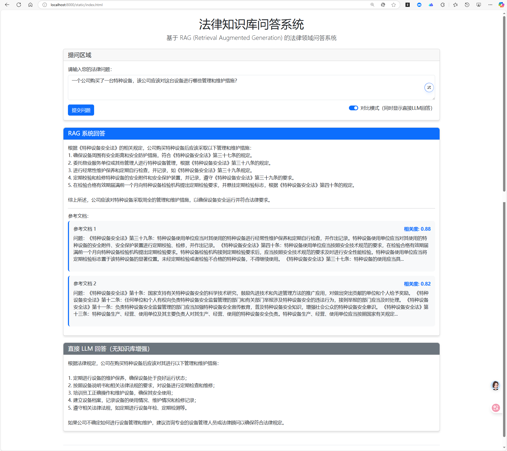

# RAG 知识库问答系统

这是一个基于 RAG (Retrieval Augmented Generation) 的知识库问答系统，专门针对法律领域的问答场景设计。系统采用先进的向量检索和大语言模型技术，实现了高效精准的法律知识问答。通过结合检索增强生成技术，系统能够提供更加准确、可靠的法律咨询服务。



## 💡 系统特点

- **专业领域设计**：基于法律问答数据集构建，专门针对法律领域的问答需求，包含大量法律条款和专业知识
- **高效检索**：使用 FAISS 向量数据库，支持快速、高效的相似文档检索，毫秒级响应
- **智能问答**：集成 OpenAI GPT 模型，提供准确、连贯的回答，同时支持直接LLM回答与RAG回答的对比
- **可扩展架构**：模块化设计，易于扩展和维护，支持不同模型和检索策略的替换
- **全面评估**：内置评估模块，支持系统性能的量化评估，包括检索质量和生成质量的多维度评估
- **用户友好界面**：提供直观的Web界面，方便用户提问和查看回答结果

## 🔍 系统架构

```
rag_project/
├── data/                      # 数据存储目录
│   ├── documents/            # 原始文档存储
│   └── vectors/             # 向量数据存储
│       └── faiss_index/    # FAISS 向量索引
├── src/                      # 源代码目录
│   ├── api/                 # API 接口模块
│   │   ├── __init__.py     # 模块初始化
│   │   └── routes.py       # API路由定义
│   ├── document_processor/  # 文档处理模块
│   │   └── loader.py       # 文档加载器
│   ├── vectorstore/        # 向量存储模块
│   │   └── embeddings.py   # 向量嵌入实现
│   ├── retriever/          # 检索模块
│   │   └── vector_search.py # 向量检索实现
│   ├── llm/                # LLM 集成模块
│   │   ├── base.py         # LLM基类
│   │   └── openai.py       # OpenAI实现
│   ├── rag/                # RAG 核心实现
│   │   ├── pipeline.py     # RAG处理流程
│   │   └── prompt.py       # 提示词模板
│   ├── evaluation/         # 评估模块
│   │   └── metrics.py      # 评估指标
│   ├── utils/              # 工具函数
│   │   └── helpers.py      # 辅助函数
│   ├── config.py           # 配置文件
│   ├── main.py             # 主程序入口
│   ├── process_documents.py # 文档处理脚本
│   ├── test_rag.py         # RAG测试脚本
│   ├── test_compare.py     # 对比测试脚本
│   ├── test_search.py      # 搜索测试脚本
│   └── check_texts.py      # 文本检查脚本
├── static/                  # 前端静态文件
│   ├── css/                # CSS样式文件
│   │   └── styles.css      # 主样式表
│   ├── js/                 # JavaScript文件
│   │   └── main.js         # 主脚本
│   └── index.html          # 前端主页面
├── test_results/           # 测试结果目录
│   ├── comparison_results.json # 对比测试结果
│   ├── evaluation_results.json # 评估结果
│   ├── rag_results.json    # RAG测试结果
│   └── search_results.json # 搜索测试结果
├── .env                     # 环境变量配置
├── .gitignore              # Git忽略文件
├── README.md               # 项目说明文档
└── requirements.txt        # 依赖包列表
```

## 🛠️ 核心模块说明

### 1. 文档处理模块 (document_processor)
- 负责原始文档的加载和预处理
- 支持文本分块，确保检索粒度合适
- 处理各种格式的输入文档
- 实现了针对法律文档的特殊处理逻辑，包括问题、答案和法律依据的格式化

### 2. 向量存储模块 (vectorstore)
- 使用 m3e-base 模型进行文本向量化，该模型专为中文语义理解优化
- 采用 FAISS 进行高效的向量存储和检索，支持百万级文档的快速检索
- 支持增量更新和持久化存储，便于知识库的动态扩展
- 实现了查询增强功能，提高检索准确性
- 支持相似度阈值过滤，确保检索结果的质量

### 3. 检索模块 (retriever)
- 实现基于语义的相似文档检索，而非简单的关键词匹配
- 支持 Top-K 检索和相似度阈值过滤，可根据需求调整检索范围和质量
- 提供批量检索能力，支持高并发场景
- 集成了错误处理和日志记录，提高系统稳定性

### 4. LLM 模块 (llm)
- 集成 OpenAI GPT 模型，支持多种模型选择（如gpt-3.5-turbo、gpt-4等）
- 支持参数化配置（温度、最大 token 等），可根据需求调整生成策略
- 实现 token 计数和成本控制，优化API调用成本
- 提供批量生成功能，提高处理效率
- 实现了统一的接口抽象，便于未来集成其他LLM模型

### 5. RAG 核心实现 (rag)
- 统一的 RAG 处理管道，将检索和生成无缝集成
- 智能提示词模板管理，针对法律领域优化的提示词设计
- 结果格式化和后处理，提供结构化的回答
- 支持文档相关性评分，帮助用户判断回答的可靠性
- 提供元数据统计，包括token使用情况等信息

### 6. 评估模块 (evaluation)
- 支持多维度的系统评估，包括检索质量和生成质量
- 提供详细的评估指标，如精确率、召回率、语义相似度等
- 结果可视化和报告生成，便于系统性能分析
- 支持RAG系统与直接LLM回答的对比评估
- 实现了基于标准答案的自动化评估流程

### 7. API接口模块 (api)
- 基于FastAPI实现RESTful API接口
- 支持单条查询和批量查询功能
- 实现了错误处理和请求验证
- 提供了详细的API文档（通过Swagger UI）
- 支持CORS，便于前端集成

### 8. 前端界面 (static)
- 提供直观的Web用户界面，无需编程知识即可使用系统
- 支持问题输入和结果展示
- 实现了RAG回答与直接LLM回答的对比功能
- 展示检索到的相关文档及其相关度分数
- 响应式设计，适配不同设备

## 📦 安装指南

1. 克隆项目并创建虚拟环境：
```bash
git clone [项目地址]
cd rag_project
python -m venv venv
source venv/bin/activate  # Linux/Mac
venv\Scripts\activate     # Windows
```

2. 安装依赖：
```bash
pip install -r requirements.txt
```

如果安装过程中遇到问题，可能需要单独安装一些依赖：
```bash
# 安装FAISS
pip install faiss-cpu  # 如果有GPU，可以安装faiss-gpu

# 安装Sentence Transformers
pip install sentence-transformers

# 安装FastAPI和相关依赖
pip install fastapi uvicorn

# 安装OpenAI
pip install openai
```

3. 环境配置：
- 在项目根目录创建 .env 文件
- 设置必要的环境变量：
```
OPENAI_API_KEY=你的OpenAI API密钥
LLM_MODEL=gpt-3.5-turbo  # 或其他支持的模型，如gpt-4
```

4. 数据准备：
- 将法律文档数据集放在项目根目录下
- 默认使用的是 DISC-Law-SFT-Triplet-QA-released.jsonl 数据集
- 如果使用其他数据集，需要在 config.py 中修改 KNOWLEDGE_BASE 路径

## 🚀 使用指南

### 1. 数据处理与向量化
```bash
# 处理文档并创建向量索引
python src/process_documents.py
```

这个步骤会：
- 加载法律文档数据集
- 处理文档内容，提取问题、答案和法律依据
- 使用 m3e-base 模型将文本转换为向量
- 创建 FAISS 索引并保存到 data/vectors/faiss_index 目录
- 进行简单的搜索测试，验证索引效果

注意：向量化过程可能需要较长时间（取决于文档数量和计算资源），建议使用GPU加速。如果文档太大，可以先用部分文档进行测试。

### 2. 启动服务
```bash
# 启动 Web 服务
python src/main.py
```

启动后：
- API服务将在 http://localhost:8000 运行
- Web界面可通过浏览器访问 http://localhost:8000
- API文档可通过 http://localhost:8000/docs 访问

### 3. 使用Web界面
1. 打开浏览器访问 http://localhost:8000
2. 在文本框中输入法律问题
3. 选择是否启用"对比模式"（同时显示直接LLM回答）
4. 点击"提交问题"按钮
5. 查看RAG系统回答和参考文档
6. 如果启用了对比模式，还可以查看直接LLM回答

### 4. 使用API接口
系统提供了多个API接口，可以通过编程方式调用：

```python
import requests

# 单条搜索
response = requests.post(
    "http://localhost:8000/search",
    json={"query": "什么是民事诉讼？", "top_k": 3}
)
results = response.json()

# RAG问答（可选对比）
response = requests.post(
    "http://localhost:8000/api/ask",
    json={"query": "什么是民事诉讼？", "compare": True}
)
answer = response.json()
```

### 5. 系统评估
```bash
# 运行基础RAG评估
python src/test_rag.py

# 运行RAG与直接LLM对比评估
python src/test_compare.py

# 运行搜索模块评估
python src/test_search.py
```

评估结果将保存在 test_results 目录下，包括：
- rag_results.json：RAG系统测试结果
- comparison_results.json：RAG与直接LLM对比结果
- evaluation_results.json：系统评估指标
- search_results.json：搜索模块测试结果

## ⚙️ 关键配置说明

配置文件位于 `src/config.py`，主要包含以下配置项，可以根据需要进行调整：

### 基础路径配置
```python
BASE_DIR = Path(__file__).parent.parent  # 项目根目录
DATA_DIR = BASE_DIR / "data/documents"   # 文档目录
VECTOR_DIR = BASE_DIR / "data/vectors"   # 向量存储目录
KNOWLEDGE_BASE = BASE_DIR / "DISC-Law-SFT-Triplet-QA-released.jsonl"  # 知识库文件路径
```

### 文档处理配置
```python
CHUNK_SIZE = 1000      # 文档分块大小
CHUNK_OVERLAP = 200    # 分块重叠长度
```
- CHUNK_SIZE：控制文档分块的大小，较大的值可能包含更多上下文，但可能降低检索精度
- CHUNK_OVERLAP：控制相邻分块的重叠部分，较大的值可以减少信息丢失，但会增加存储需求

### 向量存储配置
```python
EMBEDDING_MODEL = "moka-ai/m3e-base"  # 向量模型
VECTOR_DB_PATH = VECTOR_DIR / "faiss_index"  # 向量数据库路径
```
- EMBEDDING_MODEL：用于文本向量化的模型，默认使用专为中文优化的m3e-base模型
- VECTOR_DB_PATH：FAISS索引和文本数据的存储路径

### LLM 配置
```python
OPENAI_API_KEY = os.getenv("OPENAI_API_KEY")  # 从环境变量获取API密钥
LLM_MODEL = os.getenv("LLM_MODEL", "gpt-3.5-turbo")  # 使用的语言模型
MAX_TOKENS = 2000  # 最大生成token数
TEMPERATURE = 0.7  # 温度参数
```
- OPENAI_API_KEY：OpenAI API密钥，从环境变量获取
- LLM_MODEL：使用的语言模型，可选gpt-3.5-turbo、gpt-4等
- MAX_TOKENS：控制生成回答的最大长度
- TEMPERATURE：控制生成的随机性，较高的值会产生更多样化的回答，较低的值会产生更确定性的回答

### RAG 配置
```python
TOP_K = 2  # 检索文档数量
MIN_SIMILARITY_SCORE = 0.5  # 最小相似度阈值
```
- TOP_K：每次检索返回的相关文档数量，较大的值可能提供更多信息，但可能引入噪声
- MIN_SIMILARITY_SCORE：相似度阈值，低于此值的检索结果将被过滤，范围为0-1

### 评估配置
```python
METRICS_MODEL = "moka-ai/m3e-base"  # 用于评估的语义相似度模型
EVAL_OUTPUT_DIR = BASE_DIR / "evaluation/results"  # 评估结果保存目录
```
- METRICS_MODEL：用于计算语义相似度的模型，用于评估生成质量
- EVAL_OUTPUT_DIR：评估结果的保存目录

## 📊 性能指标与评估

系统评估结果存储在 test_results 目录下，包含多个评估文件：

### 1. RAG系统评估 (rag_results.json)
包含RAG系统的详细评估结果，主要指标：
- 检索文档的相关性和质量
- 生成回答的准确性和完整性
- Token使用情况和处理时间

### 2. 对比测试结果 (comparison_results.json)
对比RAG系统与直接LLM回答的差异：
- RAG系统回答：基于检索到的相关文档生成
- 直接LLM回答：仅依靠模型自身知识生成
- 对比分析：准确性、专业性、可靠性等维度的对比

### 3. 整体评估结果 (evaluation_results.json)
系统整体性能的量化评估：
- 检索评估指标：精确率(Precision)、召回率(Recall)、F1分数
- 生成评估指标：语义相似度、BLEU分数、ROUGE分数
- 综合评估：系统整体效果评分

### 4. 搜索模块测试结果 (search_results.json)
向量检索模块的独立评估：
- 检索速度：平均查询时间
- 检索质量：相关文档的排名情况
- 关键词覆盖率：检索结果对关键词的覆盖程度

### 评估方法说明
系统采用多种评估方法来全面衡量性能：

1. **自动化评估**：
   - 使用预定义的标准答案进行对比
   - 计算语义相似度和文本重叠度
   - 分析关键信息的覆盖情况

2. **对比评估**：
   - RAG系统 vs 直接LLM回答
   - 检索增强前后的效果对比
   - 不同参数配置下的性能变化

3. **关键指标**：
   - 检索准确率：检索到的相关文档比例
   - 回答准确性：生成回答与标准答案的一致程度
   - 法律依据引用：回答中正确引用法律条款的情况
   - 处理效率：响应时间和资源消耗

## 📝 注意事项与最佳实践

### 系统部署注意事项
1. **资源需求**：
   - 向量化过程计算密集，建议使用GPU加速（尤其是处理大型数据集时）
   - 服务运行需要至少4GB内存，生产环境建议8GB以上
   - FAISS索引可能占用较大磁盘空间，请确保有足够存储空间

2. **安全性考虑**：
   - API密钥请妥善保管，建议使用环境变量或密钥管理服务
   - 不要将包含API密钥的.env文件提交到代码仓库
   - 生产环境中应限制CORS来源，避免使用"*"通配符

3. **性能优化**：
   - 生产环境建议使用Gunicorn或Uvicorn+Nginx部署
   - 考虑使用负载均衡来处理高并发请求
   - 实现请求缓存机制，避免重复计算
   - 对于频繁查询的问题，可以实现结果缓存

### 使用建议
1. **数据质量**：
   - 确保知识库文档质量高，内容准确
   - 定期更新知识库，保持法律信息的时效性
   - 考虑添加元数据标记，提高检索精度

2. **参数调优**：
   - 根据实际需求调整TOP_K参数（检索文档数量）
   - 调整MIN_SIMILARITY_SCORE阈值以平衡召回率和精确率
   - 根据回答质量调整LLM的temperature参数

3. **错误处理**：
   - 实现完善的错误处理和日志记录
   - 设置请求超时和重试机制
   - 添加系统监控，及时发现并解决问题

4. **用户体验**：
   - 提供清晰的使用指南和示例问题
   - 在回答中明确引用法律依据，增强可信度
   - 考虑添加反馈机制，收集用户评价

## 🔄 开发计划与路线图

### 已完成功能
- [x] 基础文档处理和向量化
- [x] 实现检索模块
- [x] 集成 OpenAI LLM
- [x] 完整 RAG 流程
- [x] 评估和优化
- [x] Web前端界面
- [x] API接口设计
- [x] 系统性能评估

### 近期开发计划
- [ ] 支持更多文档格式（PDF、Word、HTML等）
- [ ] 优化提示词模板，提高回答质量
- [ ] 增加结果缓存机制，提高响应速度
- [ ] 改进评估指标，更全面衡量系统性能
- [ ] 添加用户反馈机制，收集改进建议

### 中长期规划
- [ ] 支持多种语言模型（国产大模型、开源模型等）
- [ ] 实现知识库增量更新机制
- [ ] 添加对话历史管理，支持多轮对话
- [ ] 开发管理后台，便于知识库维护
- [ ] 实现法律文档自动分类和标注
- [ ] 添加可视化分析工具，展示系统性能
- [ ] 支持多用户并发访问和权限管理
- [ ] 开发移动端应用，提供随时随地的法律咨询

### 技术探索方向
- [ ] 混合检索策略（语义检索+关键词检索）
- [ ] 自适应提示词生成
- [ ] 法律专业知识图谱构建
- [ ] 检索增强生成的新技术研究
- [ ] 大规模向量数据库优化

## 🤝 贡献指南

我们非常欢迎社区贡献，无论是代码贡献、文档改进还是问题反馈！

### 如何贡献
1. Fork 本仓库
2. 创建你的特性分支 (`git checkout -b feature/amazing-feature`)
3. 提交你的更改 (`git commit -m 'Add some amazing feature'`)
4. 推送到分支 (`git push origin feature/amazing-feature`)
5. 创建一个 Pull Request

### 贡献前须知
- 请确保在提交 PR 前运行所有测试并确保通过
- 更新相关文档，确保文档与代码保持一致
- 遵循项目的代码规范和风格指南
- 为新功能添加适当的测试
- 保持提交信息清晰明了

### 贡献类型
- **代码贡献**：修复bug、添加新功能、优化性能等
- **文档改进**：完善README、添加示例、改进注释等
- **测试用例**：增加测试覆盖率、添加边界条件测试等
- **问题反馈**：报告bug、提出功能建议等

## 📄 许可证

本项目采用 MIT 许可证

```
MIT License

Copyright (c) 2023 RAG知识库问答系统

Permission is hereby granted, free of charge, to any person obtaining a copy
of this software and associated documentation files (the "Software"), to deal
in the Software without restriction, including without limitation the rights
to use, copy, modify, merge, publish, distribute, sublicense, and/or sell
copies of the Software, and to permit persons to whom the Software is
furnished to do so, subject to the following conditions:

The above copyright notice and this permission notice shall be included in all
copies or substantial portions of the Software.

THE SOFTWARE IS PROVIDED "AS IS", WITHOUT WARRANTY OF ANY KIND, EXPRESS OR
IMPLIED, INCLUDING BUT NOT LIMITED TO THE WARRANTIES OF MERCHANTABILITY,
FITNESS FOR A PARTICULAR PURPOSE AND NONINFRINGEMENT. IN NO EVENT SHALL THE
AUTHORS OR COPYRIGHT HOLDERS BE LIABLE FOR ANY CLAIM, DAMAGES OR OTHER
LIABILITY, WHETHER IN AN ACTION OF CONTRACT, TORT OR OTHERWISE, ARISING FROM,
OUT OF OR IN CONNECTION WITH THE SOFTWARE OR THE USE OR OTHER DEALINGS IN THE
SOFTWARE.
```

## 📧 联系方式

如有任何问题或建议，请通过以下方式联系我们：

- 项目Issues: [GitHub Issues](https://github.com/yourusername/rag_project/issues)
- 电子邮件: your.email@example.com

---

感谢您对本项目的关注和支持！
